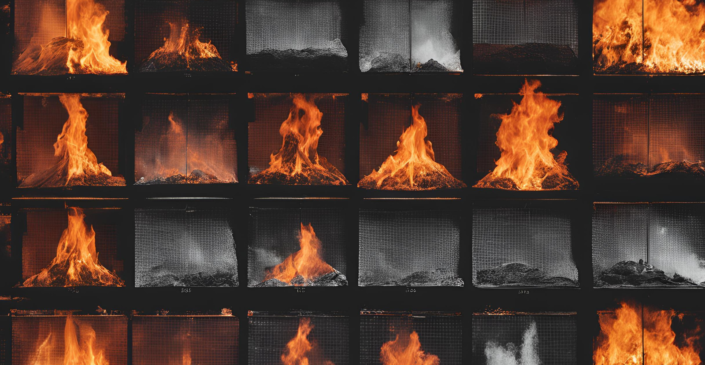
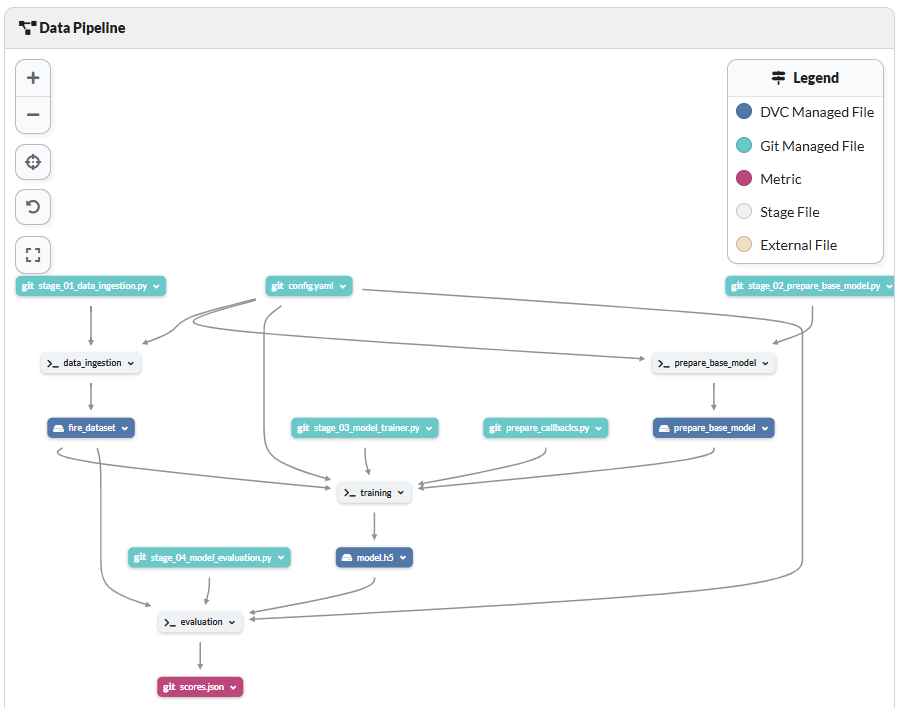

# Fire Image Detection and Classification with Deep Learning: A CI/CD-Enabled Web Application

This repository contains the complete pipeline and application for a fire image detection and classification project. The system uses deep learning to distinguish between images containing fire and non-fire images, integrating robust tools and frameworks for development, tracking, deployment, and scalability.

---
## Table of Contents
- [Project Overview](#project-overview)
- [Dataset](#dataset)
- [Directory Structure](#directory-structure)
- [Key Features](#key-features)
- [Tools and Technologies](#tools-and-technologies)
- [Project Workflow](#project-workflow)
- [Setup Instruction](#setup-instruction)
- [Azure Deployment Workflow](#azure-deployment-workflow)
- [Future Work](#future-work)
- [Contributing](#contributing)
- [License](#license)

## Project Overview
The Fire Image Detection and Classification Application is a deep learning-based solution designed to identify fire in images and classify them as either "fire images" or "non-fire images." Using transfer learning with the VGG19 architecture, the model is fine-tuned to achieve high accuracy for binary fire classification. The application integrates modern tools such as DVC for data versioning, MLflow for experiment tracking, Docker for containerisation, and Azure services for scalable deployment. A user-friendly web app built with Flask enables real-time classification, with a CI/CD pipeline ensuring seamless integration and deployment.

This project addresses the growing need for early fire detection in various contexts, leveraging AI to improve fire prevention strategies. By processing visual data, the application offers a reliable and efficient solution for identifying fire in images, whether for integration into surveillance systems, industrial monitoring, or disaster management tools. The system is adaptable to diverse environments, from urban safety systems to remote wildfire detection, demonstrating its scalability and real-world utility.

## Dataset
The dataset used for training and evaluating the model was sourced from [Kaggle](https://www.kaggle.com/datasets/phylake1337/fire-dataset). It consists of two main folders: fire_images and non_fire_images. The fire_images folder contains 755 images of outdoor fire scenes, some of which include heavy smoke, while the non_fire_images folder includes 244 nature images featuring diverse subjects such as forests, trees, grass, rivers, people, foggy forests, lakes, animals, roads, and waterfalls.

To optimize storage and retrieval, the dataset was compressed and uploaded to an AWS S3 bucket. This setup allowed the dataset to be seamlessly accessed during the pipeline for model training and evaluation, ensuring efficient data handling and processing. By organizing the data in this way, the project facilitated a streamlined workflow for robust model development and reproducibility.

## Directory Structure

```
.
├── .github/                  
│   └── workflows/
│       └── main_fireapp01.yml
├── artifacts/
│   ├── data_ingestion/
│   ├── prepare_base_model/
│   ├── prepare_callbacks/
│   └── training/
├── log/
│   └── running_logs.log        
├── research/
│   ├── 01_data_ingestion.ipynb
│   ├── 02_prepare_base_model.ipynb
│   ├── 03_model_trainer.ipynb
│   ├── 04_model_evaluation_with_mlflow.ipynb
│   └── 05_prediction.ipynb
├── src/                  
│   └── fire_image_classifier/
│       ├── components/
│       ├── conf/
│       ├── config/
│       ├── constants/
│       ├── entity/
│       ├── pipeline/
│       ├── templates/               # HTML templates
│       ├── utils/
│       ├── app.py                   # Main Flask application
│       ├── main.py
│       └── params.yaml
├── Dockefile                        # Docker configuration file    
├── dvc.yaml                         # DVC pipeline stages
├── README.md                        # Project documentation
├── constraints.txt                  # Python dependencies
├── scores.json      
├── pyproject.toml             
└── template.py             
```
## Key Features

- **Data Pipeline**: Data ingestion from an S3 bucket using DVC for reproducibility.
- **Model Development**: Transfer learning with ResNet50 trained on ImageNet, updated for binary classification (fire and non-fire images).
- **Experiment Tracking**: Integrated with MLflow and Dagshub for tracking metrics and models.
- **Web Application**: Flask-based application for image classification.
- **CI/CD Pipeline**: Automated deployment to Azure Web App Service using Docker, Azure Container Registry (ACR), and GitHub Actions.


## Tools and Technologies

- **Programming Language**: Python
- **Deep Learning**: TensorFlow, Keras, VGG19 (Transfer Learning)
- **Pipeline Management**: DVC, Dagshub
- **Experiment Tracking**: MLflow
- **Web Framework**: Flask
- **Cloud Services**: S3, Azure Web App Service, Azure Container Registry (ACR)
-**Version Control and CI/CD**: GitHub, GitHub Actions, Docker


## Project Workflow

1. **Data Ingestion**
   - Dataset for training and evaluation is ingested from an S3 bucket.
   - DVC is used for versioning and managing data pipelines.

2. **Model Development**
   - Transfer learning applied to VGG19 pre-trained on ImageNet.
   - Top layers of VGG19 replaced with:
     - A Flatten layer
     - Dense layer with SoftMax activation (2 units for binary classification: fire vs. non-fire).
   - Model training includes Keras callbacks for optimisation.

3. **Model Evaluation**
   - Validation dataset used for performance evaluation.
   - MLflow and Dagshub used for experiment tracking and model versioning.

4. **Web Application**
   - Flask-based interface for image upload and classification.
   - Responds with predictions: "Fire Image" or "Non-Fire Image".

5. **CI/CD Workflow**
   - Source code pushed to GitHub triggers GitHub Actions.
   - GitHub Actions:
     - Builds Docker image.
     - Pushes Docker image to Azure Container Registry (ACR).
     - Deploys the Docker container to Azure Web App Service.



## Setup Instruction

### Prerequisites
1. Python 3.10 or above
2. Docker installed on your machine
3. Azure account with Web App Service and Container Registry
4. AWS account with access to the S3 bucket containing the dataset
5. GitHub Account

### Local Setup
1. **Clone the repository**:
```
git clone https://github.com/OlumideOlumayegun/fire-image-classification.git
cd fire-image-classification
```
2. **Create a virtual environment**
```
python -m venv venv
venv\Scripts\activate # For Windows
```
3. **Install dependencies**:
```
pip install -c constraints.txt .
```
4. **Run the application locally**:
```
python src/fire_image_classifier/app.py
```
5. Access the app at http://localhost:8080 in your browser.

### Running with Docker 
1. **Build the Docker image**
```
docker build -t fire-image-detection .
```
2. **Run the Docker container**
```
docker run -p 8080:8080 fire-image-detection
```
3. Access the app at http://localhost:8080.

## Azure Deployment Workflow
1. Push the source code to GitHub.
2. GitHub Actions:
   + Build the Docker image.
   + Push the image to Azure Container Registry.
   + Deploy the app to Azure Web App Service.
3. Access the deployed app via the Azure-provided URL.

## Future Work
While the fire detection and classification app demonstrates robust performance, there are several opportunities for improvement and expansion:

1. Improved Model Performance: 
   - Experiment with other advanced CNN architectures (e.g., EfficientNet, Vision Transformers) to improve classification accuracy
   - Increase dataset diversity by collecting and labeling additional fire and non-fire images from various environments.

2. Multiclass Classification
   - Extend the model to classify additional fire-related categories, such as smoke, extinguished fire sites, or high-risk areas.

## Contributing
Contributions are welcome! Please fork the repository, make your changes, and submit a pull request.

## License
This project is licensed under the MIT License. See the LICENSE file for details.
